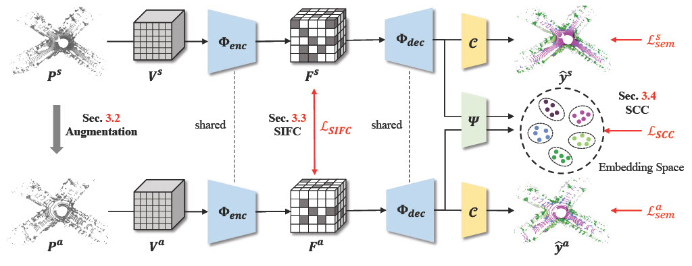

# DGLSS: Single Domain Generalization for LiDAR Semantic Segmentation (CVPR 2023)

The is the official Pytorch implementation of our work "Single Domain Generalization for LiDAR Semantic Segmentation".

### [Paper](https://openaccess.thecvf.com/content/CVPR2023/papers/Kim_Single_Domain_Generalization_for_LiDAR_Semantic_Segmentation_CVPR_2023_paper.pdf)

[Hyeonseong Kim*](https://scholar.google.com/citations?hl=ko&user=EP5c3uwAAAAJ), [Yoonsu Kang*](https://scholar.google.com/citations?user=toSjxOAAAAAJ&hl=ko&oi=sra), [Changgyoon Oh](https://scholar.google.com/citations?user=Ib9NEG0AAAAJ&hl=ko&oi=sra), [Kuk-Jin Yoon](https://scholar.google.com/citations?user=1NvBj_gAAAAJ&hl=ko&oi=sra)

(* The first two authors contributed equally. In alphabetical order.)

## Abstract
With the success of the 3D deep learning models, various perception technologies for autonomous driving have
been developed in the LiDAR domain. While these models perform well in the trained source domain, they struggle in unseen domains with a domain gap. In this paper, we propose a **single domain generalization method for
LiDAR semantic segmentation (DGLSS)** that aims to ensure good performance not only in the source domain but
also in the unseen domain by learning only on the source
domain. We mainly focus on generalizing from a dense
source domain and target the domain shift from different
LiDAR sensor configurations and scene distributions. To
this end, we augment the domain to simulate the unseen domains by randomly subsampling the LiDAR scans. With the
augmented domain, we introduce two constraints for generalizable representation learning: sparsity invariant feature consistency (SIFC) and semantic correlation consistency (SCC). The SIFC aligns sparse internal features of
the source domain with the augmented domain based on the
feature affinity. For SCC, we constrain the correlation between class prototypes to be similar for every LiDAR scan.
We also establish a standardized training and evaluation
setting for DGLSS. With the proposed evaluation setting,
our method showed improved performance in the unseen
domains compared to other baselines. Even without access to the target domain, our method performed better than
the domain adaptation method.

## Requirements
The code has been tested with Python 3.8, CUDA 11.1, pytorch 1.8.0, and pytorch-lightning 1.6.5.

Make a virtual environment using conda, and install the following packages.

* python
* pytorch
* pytorch-lightning
* [MinkowskiEngine](https://github.com/NVIDIA/MinkowskiEngine)
* easydict
* munch
* PyYAML
* scikit-learn
* numba

## Datasets
We use SemanticKITTI, nuScenes-lidarseg, Waymo, and SemanticPOSS.

### SemanticKITTI
Download the dataset from [here](http://www.semantic-kitti.org/) and prepare the dataset directory as follows.
~~~
path_to_SemanticKITTI
    |- sequences
        |- 00/
            |- labels
                |- 000000.label
                |_ ...
            |- velodyne
                |- 000000.bin
                |_ ...
            |- calib.txt
            |- poses.txt
            |- times.txt
        |_ ...
~~~

### nuScenes-lidarseg
Download the dataset from [here](https://www.nuscenes.org/nuscenes#overview) and prepare the dataset directory as follows.
~~~
path_to_nuScenes
    |- lidarseg
        |- v1.0-{mini, test, trainval}
            |- xxxx_lidarseg.bin
            |_ ...
    |- samples
        |- LIDAR_TOP
            |- xxxx.pcd.bin
            |_ ...
    |- sweeps
    |- v1.0-{mini, test, trainval}
        |- ***.json
        |_ ...
    |- nuscenes_infos_{train, val, test}.pkl
~~~

### Waymo
Download the dataset from [here](https://waymo.com/open/data/perception/) and prepare the dataset directory as follows.
~~~
path_to_Waymo
    |- 0000/
        |- labels
            |- 000000.label
            |_ ...
        |- velodyne
            |- 000000.bin
            |_ ...
    |_ 0999/
~~~

### SemanticPOSS
Download the dataset from [here](http://www.poss.pku.edu.cn/semanticposs.html) and prepare the dataset directory as follows.
~~~
path_to_POSS
    |- sequences
        |- 00/
            |- labels
                |- 000000.label
                |_ ...
            |- velodyne
                |- 000000.bin
                |_ ...
            |- tag
                |- 000000.tag
                |_ ...
            |- calib.txt
            |- poses.txt
            |- times.txt
        |_ ...
~~~

## Train
Run the following command for training:
~~~
python main.py --logdir='name for current experiment log directory' --config='path to config file for source dataset'
~~~
Specify the checkpoint path if you want to resume or load pretrained weights in config_{dataset_name}.yaml (train_params.resume_ckpt or pretrained_ckpt_path)

## Test
Run the following command for testing:
~~~
python main.py --logdir='name for current experiment test log directory' --test --config='path to config file for source dataset'
~~~
Specify the path of checkpoint to test in config_{dataset_name}.yaml (test_params.ckpt_path)

## Reference
If you use our work, please cite us!

~~~
@inproceedings{kim2023single,
  title={Single Domain Generalization for LiDAR Semantic Segmentation},
  author={Kim, Hyeonseong and Kang, Yoonsu and Oh, Changgyoon and Yoon, Kuk-Jin},
  booktitle={Proceedings of the IEEE/CVF Conference on Computer Vision and Pattern Recognition},
  pages={17587--17598},
  year={2023}
}
~~~

